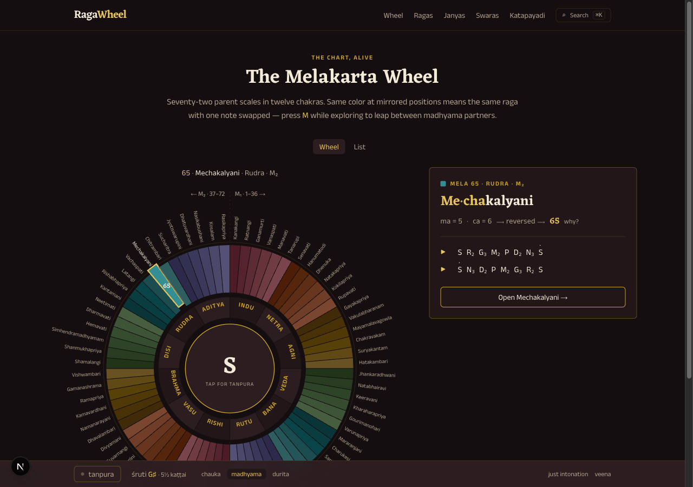
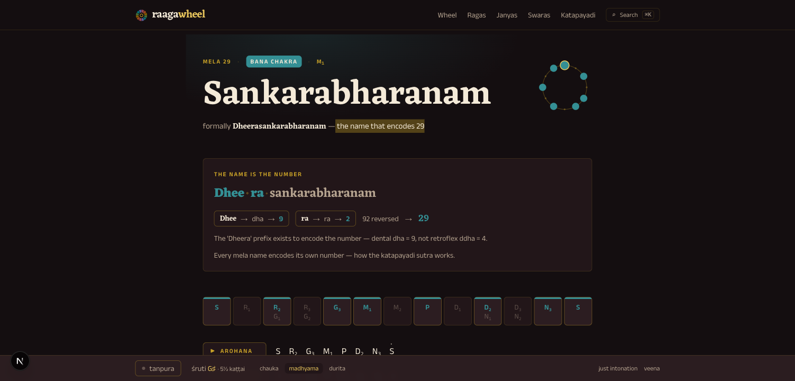

# raagawheel

**Every raga has an address.**

An interactive teaching app for the 72 melakarta ragas of Carnatic music and their janyas —
hear the scales, see the swara variants, decode the names, and chase down the songs.



## What it does

- **The Melakarta Wheel** — all 72 parent scales arranged the way the tradition arranges them:
  twelve chakras, the śuddha/prati madhyama split down the vertical axis, and a color system
  where **hue encodes the Ri–Ga family and lightness the Dha–Ni step**. Madhyama partners
  (Sankarabharanam 29 ↔ Kalyani 65) render in the same color at mirrored positions — the
  system's deepest symmetry, made visible. Press <kbd>M</kbd> on a wedge to leap between them.
- **Katapayadi, decoded** — every mela name secretly encodes its own number
  (Kha·ra·harapriya → kha=2, ra=2 → mela 22). The wheel panel decodes each name live, and
  `/katapayadi` teaches the full cipher with the consonant tables and a decoder for all 72 names.
- **A raga page for every raga** — 127 of them: playable arohana/avarohana with the sounding
  note highlighted in sync, the 16-names-on-12-keys swara strip (see *why* R₂ and G₁ are the
  same key), jeeva swaras, characteristic phrases, curated songs (krithis *and* film songs) with
  YouTube/Spotify search links, lore, and family cross-links.
- **Sound, fully synthesized** — no audio files. A Karplus-Strong tanpura drone lives in the
  wheel's hub; melodic voices (veena-ish pluck, flute) play at your chosen śruti in
  just intonation (with an equal-temperament toggle for the curious ear).
- **Raga seals** — each raga gets a visual fingerprint: its pitch-class set as dots on a
  twelve-position ring, derived from the same data as playback so it can never lie.



## Run it

```bash
npm install
npm run dev        # → http://localhost:3000
```

```bash
npm run build      # static export to ./out — deploys to any static host
npm run validate   # the data validation suite (311 tests)
```

Requires Node 20.9+. There are no environment variables, no database, and no backend —
the entire site is statically generated.

## How the data stays honest

Carnatic raga data is easy to get subtly wrong, so the architecture is built around
machine-checkable honesty:

- **Derive everything derivable.** A melakarta's scale is pure arithmetic on its number
  (`src/lib/carnatic/mela.ts`). The hand-transcribed scales in `src/data/melas/` exist so the
  validator can assert they *equal* the derivation — double-entry bookkeeping for music theory.
- **Katapayadi is verified two ways.** Each mela's syllable breakdown is hand-authored
  (romanized names are ambiguous — English "ch" is usually ca=6, and the dental ta-varga runs
  6…9, 0), then the validator re-derives every digit from the consonant table *and* checks the
  reversed number equals the mela number.
- **Janya integrity.** Every janya scale token must belong to its parent mela's swaras or be
  explicitly declared as an anya (borrowed) swara; parents must exist; vakra/audava/shadava
  classifications are computed, not asserted.
- **Songs were adversarially fact-checked.** Every song–raga attribution was verified against
  published sources during curation, and anything unverifiable was dropped rather than shipped.
  Corrections with sources are very welcome — see [CONTRIBUTING.md](CONTRIBUTING.md).

Run the whole suite with `npm run validate`.

## Stack

[Next.js 16](https://nextjs.org) (App Router, static export) · React 19 (React Compiler) ·
TypeScript · Tailwind CSS v4 · [Tone.js](https://tonejs.github.io) · Vitest.
Typefaces: [Eczar](https://fonts.google.com/specimen/Eczar) and
[Anek Latin](https://fonts.google.com/specimen/Anek+Latin).

```
src/lib/carnatic/   domain core: types, scale parser, mela derivation, katapayadi, links
src/lib/audio/      tuning (just intonation), engine, voices, tanpura
src/data/           the 72 melas (one file per chakra) + ~55 janyas (by family) + assembly
src/components/     wheel, swara strip, raga seal, sound bar, search
src/app/            routes: / /melakarta /raga/[slug] /ragas /janya /swaras /katapayadi
tests/              known-answer derivation tests + the data validation suite
```

## Contributing

Corrections to raga data (scales, song attributions, katapayadi readings) are the most
valuable contributions and need no coding — see [CONTRIBUTING.md](CONTRIBUTING.md).

## License

[MIT](LICENSE) — built with love for Carnatic music, with blessing from the forefathers. 
